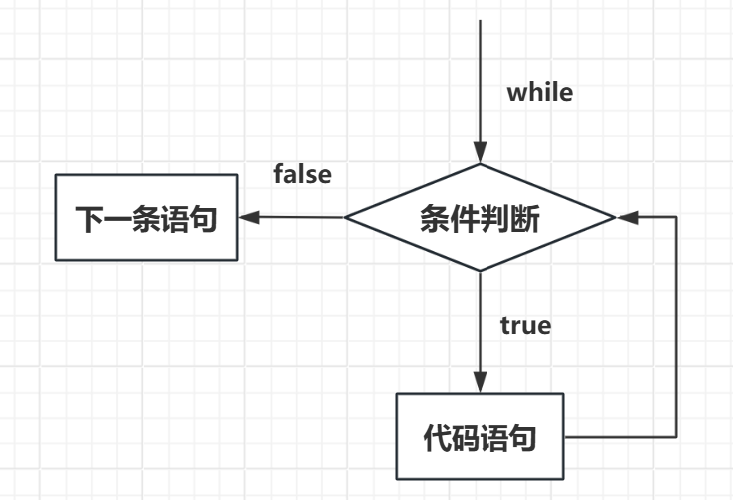
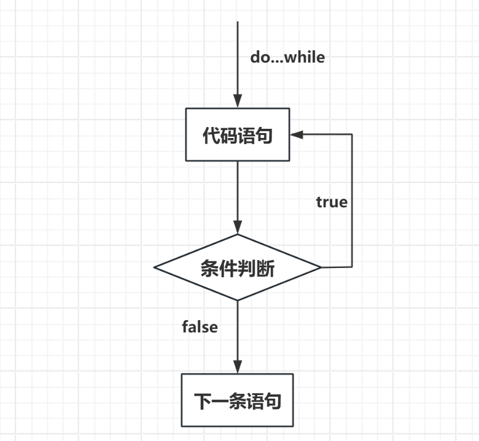
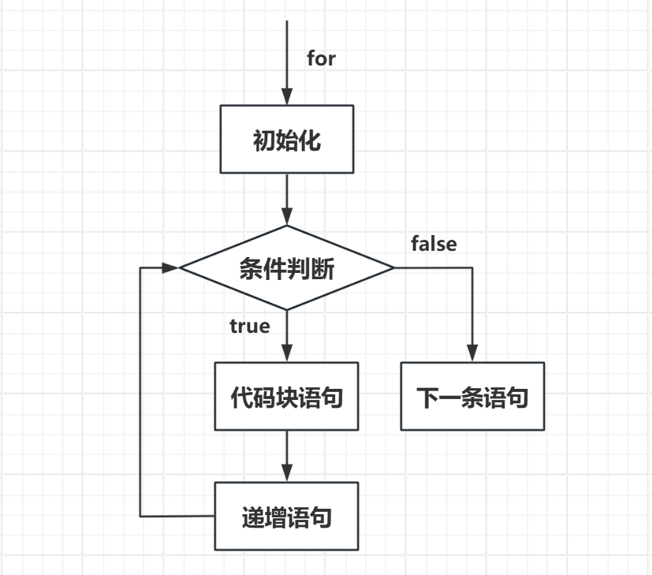
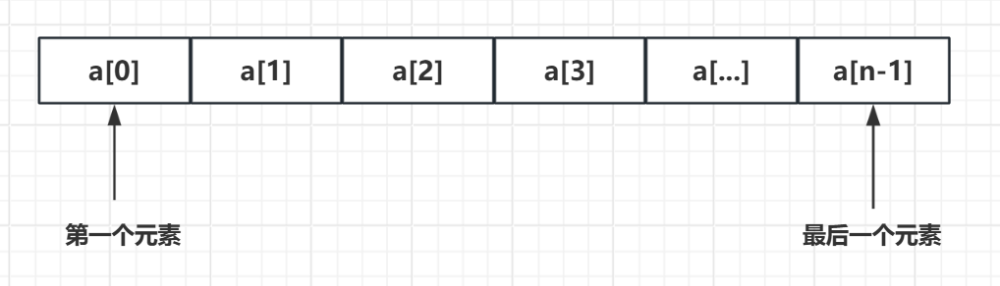

<figure markdown>
{ width="150" }
</figure>


在过去40多年里，C语言已成为最重要、最流行的编程语言之一。近20年来，虽然许多人都从C语言转而使用其他编程语言（如，C++、Java、Python等），但是C语言仍凭借自身实力在众多语言中脱颖而出。在学习C语言的过程中，会发现它的许多优点，如：

1. 高效性
2. 灵活性
3. 可移植性
4. 应用范围广

通过学习C语言不仅能掌握一门强大的编程语言，还有助于理解计算机系统底层，也能为学习其他编程语言打下坚实的基础。

本教程简单介绍了 C 语言需要掌握的主要内容，主要针对非CS类专业的读者，由于篇幅限制本教程只是抛砖引玉，文末附带了推荐学习的课程和书籍以供进一步的学习。

## **环境配置**

- **Dev-C++：** [DevC++下载及安装教程](https://blog.csdn.net/m0_54158068/article/details/124080083)

- **C VScode：** 安装VScode并安装C拓展即可——教程：[C VScode | 菜鸟教程](https://www.runoob.com/cprogramming/c-vscode.html)

## **数据类型、变量、常量**

### 基本数据类型

- **整型**（int、short、long long、unsigned）
- **浮点型**（float、double、long double）
- **字符型**（char）
- **布尔型**（bool）

### 变量的声明与定义、变量的初始化

```C
// 声明与定义
// 格式为 type variable_list；
int a,b,x,y;
float f;
char c;
// 初始化 type variable_name = value;
int a = 1, b=2;
float f = 1.732;
bool flag = true;
```

常量的两种定义方式

```c
// 使用#define定义
#define PI 3.14159
// 使用const关键字定义
const int VAR = 5;
```

## **格式化输入/输出**

printf()用于格式化输出，其格式为：

```c
printf( 格式字符串,待打印项1,待打印项2,... );
```

scanf()用于格式化输入，其格式为：

```
printf( 格式字符串,待输入项1,待输入项2,... );
```

两个函数均使用格式字符串和参数列表，需掌握格式字符串中常用的转换说明，如`%c`、`%d`、`%f`等。

## **运算符、表达式和语句**

了解并使用基本运算符，**重点掌握常见运算符的优先级**

- 算术运算符
- 关系运算符
- 逻辑运算符
- 位运算符
- 赋值运算符
- 杂项运算符

表达式

> 由运算符和运算对象组成，每个表达式都有一个值

语句

> C语言中几乎所有语句都以分号;结尾


## **循环、分支和跳转**

**while** 循环

```c
// 基本格式
while(condition)
{
	statement(s);
}
```

<figure markdown>
{ width="350" }
</figure>


**do...while** 循环

```C
// 基本格式
do {
	statement(s);
} while(condition)
```

<figure markdown>
{ width="350" }
</figure>

**for** 循环

``` C
// 基本格式
for (init; condition; increment)
{
	statement(s);
}
```

<figure markdown>
{ width="350" }
</figure>

**if else** 分支、跳转语句

```c
// 基本格式
if(boolean_expression 1)
{
   /* 当布尔表达式 1 为真时执行 */
}
else if( boolean_expression 2)
{
   /* 当布尔表达式 2 为真时执行 */
}
else if( boolean_expression 3)
{
   /* 当布尔表达式 3 为真时执行 */
}
else 
{
   /* 当上面条件都不为真时执行 */
}
```

**switch** 语句

- switch 后面的表达式的值将会与每个 case 后面的常量值进行比较，直到找到匹配的值或者执行到 default（如果存在）。
- 如果找到匹配的值，将执行相应 case 后面的代码块，然后跳出 switch 语句。
- 如果没有匹配的值，并且有 default，则执行 default 后面的代码块。
- 如果没有匹配的值，并且没有 default，则跳过整个 switch 语句直到结束。

``` c
// 基本格式
switch(expression){
    case constant-expression  :
       statement(s);
       break; /* 可选的 */
    case constant-expression  :
       statement(s);
       break; /* 可选的 */
  
    /* 可以有任意数量的 case 语句 */
    default : /* 可选的 */
       statement(s);
}
```

> **break 语句的使用：** 在每个 case 标签的代码块结束处通常需要使用 break 语句来终止 switch 语句的执行。如果没有 break 语句，程序将会继续执行下一个 case 标签中的代码，直到遇到 break 语句或 switch 语句结束。


## **函数**

**函数（function）** 是完成特定任务的独立程序代码单元。使用函数的好处：

1. 省去编写重复代码的苦差。如果程序要多次完成某项任务，那么只需要编写一个合适的函数，在需要时调用即可，也可在不同程序中调用同一个函数
2. 可以让程序更加模块化。不仅能提高代码的可读性，还便于后期修改、完善

**声明、定义、使用函数**

```c
#include <stdio.h>
 
/* 函数声明 */
int max(int num1, int num2);
 
int main ()
{
   /* 局部变量定义 */
   int a = 100;
   int b = 200;
   int ret;
 
   /* 调用函数来获取最大值 */
   ret = max(a, b);
 
   printf( "Max value is : %d\n", ret );
 
   return 0;
}
 
/* 函数返回两个数中较大的那个数 */
int max(int num1, int num2) 
{
   /* 局部变量声明 */
   int result;
 
   if (num1 > num2)
      result = num1;
   else
      result = num2;
 
   return result; 
}
```


## **数组和指针**

C 语言支持 **数组** 数据结构，它可以存储一个固定大小的相同类型元素的顺序集合。数组是用来存储一系列数据，但它往往被认为是一系列相同类型的变量。

所有的数组都是由连续的内存位置组成。最低的地址对应第一个元素，最高的地址对应最后一个元素。

数组中的特定元素可以通过索引访问，第一个索引值为 **0**。

C 语言还允许我们使用指针来处理数组，这使得对数组的操作更加灵活和高效。

<figure markdown>
{ width="500" }
</figure>

**声明、定义、使用数组**

```C
#include <stdio.h>
 
int main ()
{
   int n[ 10 ]; /* n 是一个包含 10 个整数的数组 */
   int i,j;
 
   /* 初始化数组元素 */         
   for ( i = 0; i < 10; i++ )
   {
      n[ i ] = i + 100; /* 设置元素 i 为 i + 100 */
   }
   
   /* 输出数组中每个元素的值 */
   for (j = 0; j < 10; j++ )
   {
      printf("Element[%d] = %d\n", j, n[j] );
   }
 
   return 0;
}
```

**指针**

指针也就是内存地址，指针变量是用来存放内存地址的变量。就像其他变量或常量一样，您必须在使用指针存储其他变量地址之前，对其进行声明。指针变量声明的一般形式为：

```C
type *var_name;
```

在这里，**type** 是指针的基类型，它必须是一个有效的 C 数据类型，**var_name** 是指针变量的名称。

所有实际数据类型，不管是整型、浮点型、字符型，还是其他的数据类型，对应指针的值的类型都是一样的，都是一个代表内存地址的长的十六进制数。

不同数据类型的指针之间唯一的不同是，指针所指向的变量或常量的数据类型不同。


**声明、定义、使用指针**

```C
#include <stdio.h>
 
int main ()
{
   int  var = 20;   /* 实际变量的声明 */
   int  *ip;        /* 指针变量的声明 */
 
   ip = &var;  /* 在指针变量中存储 var 的地址 */
 
   printf("var 变量的地址: %p\n", &var  );
 
   /* 在指针变量中存储的地址 */
   printf("ip 变量存储的地址: %p\n", ip );
 
   /* 使用指针访问值 */
   printf("*ip 变量的值: %d\n", *ip );
 
   return 0;
}
```

**理解指针与数组的区别与关系**

指针是C语言中的核心概念之一，也是C语言最强大的特性之一。但是指针的概念相对比较绕，初学时一定要仔细理解分析，搞清楚指针与数组的关系，并且学会安全地使用指针。


## **字符串和字符串函数**

C 语言中，字符串实际上是使用空字符 **\0** 结尾的一维字符数组。因此，**\0** 是用于标记字符串的结束。**空字符（Null character**）又称结束符，缩写 **NUL**，是一个数值为 **0** 的控制字符，**\0** 是转义字符，意思是告诉编译器，这不是字符 **0**，而是空字符。

**定义字符串**

```C
// 字符串数组和初始化
char greeting[40] = "Hi, and how are you today!";
char hello[10] = {'H','e','l','l','o','\0'};
```

**指针和字符串**

实际上，字符串的绝大多数操作都是通过指针完成的，我们可定义字符串指针来完成复杂的字符串操作。

**字符串的输入/输出函数**

- printf()和scanf()

- gets()和puts()

  > gets()会出现缓冲区溢出的危险，实际编程时几乎不会使用，可使用fgets()和gets_s()代替

**其他常用的字符串函数**

- strcpy()，字符串复制
- strcat()，字符串连接
- strlen()，求字符串长度
- strcmp()，字符串比较
- strchr()，找出特定字符第一次出现的位置
- strstr()，找出特定子字符串第一次出现的位置


## **结构**

**结构**（struct）

C 数组允许定义可存储相同类型数据项的变量，**结构** 是 C 编程中另一种用户自定义的可用的数据类型，它允许存储不同类型的数据项。结构体中的数据成员可以是基本数据类型（如 int、float、char 等），也可以是其他结构体类型、指针类型等。

结构用于表示一条记录。

定义struct 的格式如下：

```C
struct tag {
  member-list
  member-list
  member-list  
  ...
} variable-list ;
```

访问结构的成员采用 **成员访问运算符(`.`)**

**结构还拥有结构数组、结构指针等更复杂的使用方式。**

## **文件输入/输出**

学会使用常用的文件输入、输出函数

- 文件打开/关闭函数，fopen()、fclose()

  > 模式字符串，包括`"r"`、`"w"`、`"a"`、`"r+"`、`"w+"`、`"a+"`等，以控制文件的打开方式

- 文件I/O函数，fprintf()、fscanf()、fgets()、fputs()

## **内存管理**

1. 了解基本的存储类别
2. 学会使用malloc()和free()函数动态分配、回收内存

## **资源汇总**

<div class="grid cards" markdown>

-   :fontawesome-solid-globe:{ .lg .middle } __C 语言教程 | 菜鸟教程__
  
    ---


    [:octicons-arrow-right-24: <a href="https://www.runoob.com/cprogramming/c-tutorial.html" target="_blank"> C 语言教程 </a>](#)


-   :fontawesome-solid-globe:{ .lg .middle } __Duke C Programming Specialization__
  
    ---

    [:octicons-arrow-right-24: <a href="https://www.coursera.org/specializations/c-programming" target="_blank"> 课程网站 </a>](#)

    [:octicons-arrow-right-24: <a href="https://code.haidongji.com/Duke_Coursera_Intro_C/" target="_blank"> 资源和作业汇总 </a>](#)


-   :fontawesome-brands-bilibili:{ .lg .middle } __浙大翁恺C语言课程__
  
    ---

    [:octicons-arrow-right-24: <a href="https://www.bilibili.com/video/BV1dr4y1n7vA/" target="_blank"> 课程链接 </a>](#)


-   :fontawesome-brands-bilibili:{ .lg .middle } __黑马程序员C语言课程__
  
    ---

    [:octicons-arrow-right-24: <a href="https://www.bilibili.com/video/BV1vs411n7TH/" target="_blank"> 课程链接 </a>](#)

-   :fontawesome-solid-book:{ .lg .middle } __书籍推荐：《C Primer Plus》__
  
    ---

    [:octicons-arrow-right-24: <a href="https://github.com/hmsjy2017/free-ebooks/blob/master/C%20Primer%20Plus%20(6th%20Edition).pdf" target="_blank"> 课程链接 </a>](#)

</div>


<!-- 底部常驻 -->
<div class="grid cards" markdown>

-   :fontawesome-brands-weixin:{ .lg .middle } __更多升学、培训、学科指导等服务，请关注公众号 i乐湖__

    ---

    [:octicons-arrow-right-24: <a href="https://mp.weixin.qq.com/s/cN9UfU4qf2_02-FOgVKXTw" target="_blank"> "i乐湖"传送门 </a>](#)

    <figure markdown>
    { width="500" }
    </figure>

</div>

