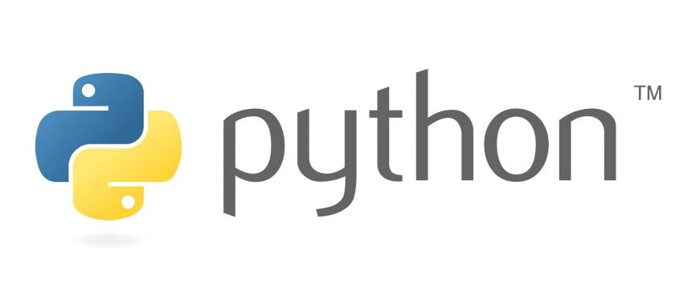
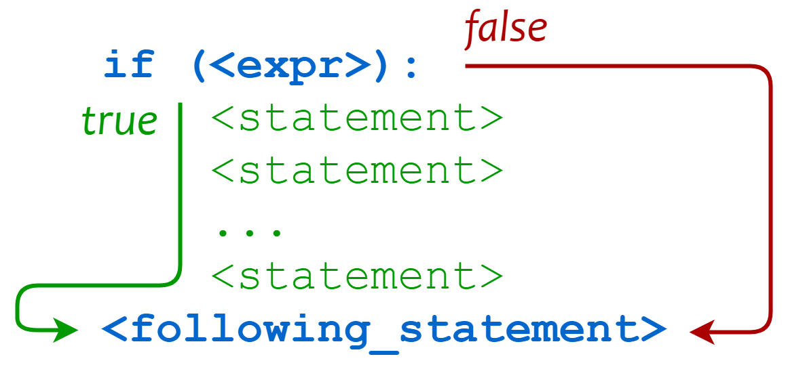

<figure markdown>

</figure>

本教程简单介绍了 Python 语言概念和功能，主要针对非CS类专业的读者，由于篇幅限制本教程只是抛砖引玉，文末附带了推荐学习的课程和书籍以供进一步的学习。

Python 是一门易于学习、功能强大的编程语言。它提供了高效的高级数据结构，还能简单有效地面向对象编程。Python 优雅的语法和动态类型以及解释型语言的本质，使它成为多数平台上写脚本和快速开发应用的理想语言。

[Python 官网](https://www.python.org/)免费提供了 Python 解释器和扩展的标准库，包括源码和适用于各操作系统的机器码形式，并可自由地分发。Python 官网还包含许多免费的第三方 Python 模块、程序和工具发布包及文档链接。

## **环境配置**

**简单版：** 直接VScode安装Python拓展即可——[VScode教程](https://www.runoob.com/python3/python-vscode-setup.html)

**Conda版：** Anaconda 是一个集成的数据科学和机器学习环境，其中包括了 Python 解释器以及大量常用的数据科学库和工具。最大的优点是可以创建虚拟环境隔离不同的包版本，推荐使用和学习，AI，大数据工作者的必备工具。

如果希望使用交互性较强的环境，推荐使用VScode + [Jupyter Notebook](https://jupyter.org/) 可以很方便地将代码与Notebook结合

## **基础语法**

### 编码

默认情况下，Python 3 源码文件以 **UTF-8** 编码，所有字符串都是 unicode 字符串。 当然你也可以为源码文件指定不同的编码。

### 标识符

- 第一个字符必须是字母表中字母或下划线 **_** 。
- 标识符的其他的部分由字母、数字和下划线组成。
- 标识符对大小写敏感。

在 Python 3 中，可以用中文作为变量名，非 ASCII 标识符也是允许的。

### Python保留字

保留字即关键字，我们不能把它们用作任何标识符名称。Python 的标准库提供了一个 keyword 模块，可以输出当前版本的所有关键字

### 行与缩进

python最具特色的就是使用缩进来表示代码块，不需要使用大括号 **{}** 。

缩进的空格数是可变的，但是同一个代码块的语句必须包含相同的缩进空格数。

## **Python3 基本数据类型**

Python3 中常见的数据类型有：

- Number（数字）
- String（字符串）
- bool（布尔类型）
- List（列表）
- Tuple（元组）
- Set（集合）
- Dictionary（字典）

Python3 的六个标准数据类型中：

- **不可变数据（3 个）：** Number（数字）、String（字符串）、Tuple（元组）；
- **可变数据（3 个）：** List（列表）、Dictionary（字典）、Set（集合）。

## **Python3 运算符**

Python 语言支持以下类型的运算符:

- 算术运算符
- 比较（关系）运算符
- 赋值运算符
- 逻辑运算符
- 位运算符
- 成员运算符
- 身份运算符
- 运算符优先级

## **Python3 条件控制**

Python 条件语句是通过一条或多条语句的执行结果（True 或者 False）来决定执行的代码块。

主要由 if elif else 以及 match...case 构成，代码执行过程：
<figure markdown>
{ width="350"}
</figure>

## **Python3 循环语句**

Python 中的循环语句有 **for** 和 **while**，同时还设有控制流关键字 **break 以及 continue**

<figure markdown>
{ width="350"}
</figure>

## **Python3 函数**

函数是组织好的，可重复使用的，用来实现单一，或相关联功能的代码段。

函数能提高应用的模块性，和代码的重复利用率。你已经知道Python提供了许多内建函数，比如print()。但你也可以自己创建函数，这被叫做用户自定义函数。

<figure markdown>

</figure>

## **Python3 简单数据结构**

### **列表**

**将列表当做栈使用**

在 Python 中，可以使用列表（list）来实现栈的功能。栈是一种后进先出（LIFO, Last-In-First-Out）数据结构，意味着最后添加的元素最先被移除。列表提供了一些方法，使其非常适合用于栈操作，特别是 **append()** 和 **pop()** 方法。

用 append() 方法可以把一个元素添加到栈顶，用不指定索引的 pop() 方法可以把一个元素从栈顶释放出来。

**将列表当作队列使用**

在 Python 中，列表（list）可以用作队列（queue），但由于列表的特点，直接使用列表来实现队列并不是最优的选择。

队列是一种先进先出（FIFO, First-In-First-Out）的数据结构，意味着最早添加的元素最先被移除。

使用列表时，如果频繁地在列表的开头插入或删除元素，性能会受到影响，因为这些操作的时间复杂度是 O(n)。为了解决这个问题，Python 提供了 collections.deque，它是双端队列，可以在两端高效地添加和删除元素。

### **集合**

集合是一个无序不重复元素的集。基本功能包括关系测试和消除重复元素。

可以用大括号 {} 创建集合。注意：如果要创建一个空集合，你必须用 set() 而不是 {} ；后者创建一个空的字典。

### **字典**

字典以关键字为索引，关键字可以是任意不可变类型，通常用字符串或数值。

理解字典的最佳方式是把它看做无序的键=>值对集合。在同一个字典之内，关键字必须是互不相同。

## **Python3 File(文件) 方法**

with open 方法的使用以及文件打开 mode 的学习（主要涉及读文件和写文件，常见的.xml文件以及.json文件的读写指令要多练习，熟练掌握）

## **Python3 面向对象**

Python从设计之初就已经是一门面向对象的语言，正因为如此，在Python中创建一个类和对象是很容易的。

如果你以前没有接触过面向对象的编程语言，那你可能需要先了解一些面向对象语言的一些基本特征，在头脑里头形成一个基本的面向对象的概念，这样有助于你更容易的学习Python的面向对象编程。

### 面向对象技术简介

- **类(Class):** 用来描述具有相同的属性和方法的对象的集合。它定义了该集合中每个对象所共有的属性和方法。对象是类的实例。
- **方法：** 类中定义的函数。
- **类变量：** 类变量在整个实例化的对象中是公用的。类变量定义在类中且在函数体之外。类变量通常不作为实例变量使用。
- **数据成员：** 类变量或者实例变量用于处理类及其实例对象的相关的数据。
- **方法重写：** 如果从父类继承的方法不能满足子类的需求，可以对其进行改写，这个过程叫方法的覆盖（override），也称为方法的重写。
- **局部变量：** 定义在方法中的变量，只作用于当前实例的类。
- **实例变量：** 在类的声明中，属性是用变量来表示的，这种变量就称为实例变量，实例变量就是一个用 self 修饰的变量。
- **继承：** 即一个派生类（derived class）继承基类（base class）的字段和方法。继承也允许把一个派生类的对象作为一个基类对象对待。例如，有这样一个设计：一个Dog类型的对象派生自Animal类，这是模拟"是一个（is-a）"关系（例图，Dog是一个Animal）。
- **实例化：** 创建一个类的实例，类的具体对象。
- **对象：** 通过类定义的数据结构实例。对象包括两个数据成员（类变量和实例变量）和方法。

和其它编程语言相比，Python 在尽可能不增加新的语法和语义的情况下加入了类机制。

Python中的类提供了面向对象编程的所有基本功能：类的继承机制允许多个基类，派生类可以覆盖基类中的任何方法，方法中可以调用基类中的同名方法。

对象可以包含任意数量和类型的数据。

## **Python 量化、数据分析简介**

Python 量化是指利用 Python 编程语言以及相关的库和工具来进行金融市场数据分析、策略开发和交易执行的过程。

Python 由于其简洁、易学、强大的生态系统和丰富的金融库而成为量化交易的首选编程语言之一。

量化交易在金融领域得到广泛应用，它允许交易者通过系统性的方法来制定和执行交易策略，提高交易效率和决策的科学性。

量化主要是通过数学和统计学的方法，利用计算机技术对金融市场进行量化分析，从而制定和执行交易策略。

常用的python包

```python
Pandas # 是一个功能强大的开源数据处理和分析库，专门设计用于高效地进行数据分析和操作。
yfinance # 是一个用于获取金融数据的库，支持从 Yahoo Finance 获取股票、指数和其他金融市场数据。
Matplotlib # 是一个二维绘图库，用于创建静态、动态和交互式的数据可视化图表。
```

常见的数据分析可视化包：Matplotlib、Seaborn 和 Pandas

<figure markdown>
{ width="350"}
</figure>

## **资源汇总**

<div class="grid cards" markdown>

-   :fontawesome-brands-python:{ .lg .middle } __Python官方教程__

    ---

    [:octicons-arrow-right-24: <a href="https://docs.python.org/zh-cn/3/tutorial/index.html" target="_blank"> Python官方文档 </a>](#)


-   :fontawesome-brands-python:{ .lg .middle } __Harvard CS50P__
  
    ---

    [:octicons-arrow-right-24: <a href="https://cs50.harvard.edu/python/2022/" target="_blank"> 课程网站 </a>](#)

    [:octicons-arrow-right-24: <a href="https://github.com/csfive/CS50P" target="_blank"> 资源和作业汇总 </a>](#)


-   :fontawesome-brands-python:{ .lg .middle } __菜鸟教程Python3__
  
    ---

    [:octicons-arrow-right-24: <a href="https://www.runoob.com/python3/python3-tutorial.html" target="_blank"> Python3教程 </a>](#)


-   :fontawesome-brands-bilibili:{ .lg .middle } __黑马程序员Python__
  
    ---

    [:octicons-arrow-right-24: <a href="https://www.bilibili.com/video/BV1qW4y1a7fU" target="_blank"> Python从入门到精通 </a>](#)

</div>


<!-- 底部常驻 -->
<div class="grid cards" markdown>

-   :fontawesome-brands-weixin:{ .lg .middle } __更多升学、培训、学科指导等服务，请关注公众号 i乐湖__

    ---

    [:octicons-arrow-right-24: <a href="https://mp.weixin.qq.com/s/cN9UfU4qf2_02-FOgVKXTw" target="_blank"> "i乐湖"传送门 </a>](#)

    <figure markdown>
    { width="150" }
    </figure>

</div>