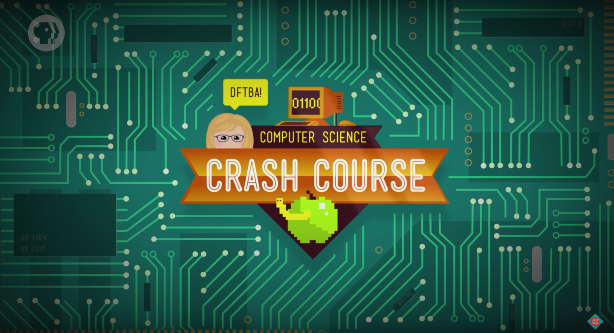

如果你是一个刚刚接触计算机的24k纯小白，那么一个有趣的科普视频将会带你速览计算机科学的前生今世。

你将探究如何从简单的二进制出发，逐步搭建一个现代的CPU，进一步编写指令程序运行，之后操作系统的出现让操作者的使用门槛大大降低，互联网的普及让人类进入信息时代，人工智能的兴起如何掀起“第四次工业革命”...

-   :fontawesome-brands-bilibili:{ .lg .middle } __科普课程__

    ---

    Crash Course Computer Science

    [:octicons-arrow-right-24: <a href="https://www.bilibili.com/video/BV1EW411u7th" target="_blank"> 传送门 </a>](#)

当然，如果想要快速了解其中某个领域，“菜鸟”教程你值得拥有:

-   :fontawesome-solid-house:{ .lg .middle } __菜鸟教程__

    ---

    菜鸟教程- 学的不仅是技术，更是梦想！

    [:octicons-arrow-right-24: <a href="https://www.runoob.com/" target="_blank"> 传送门 </a>](#)

