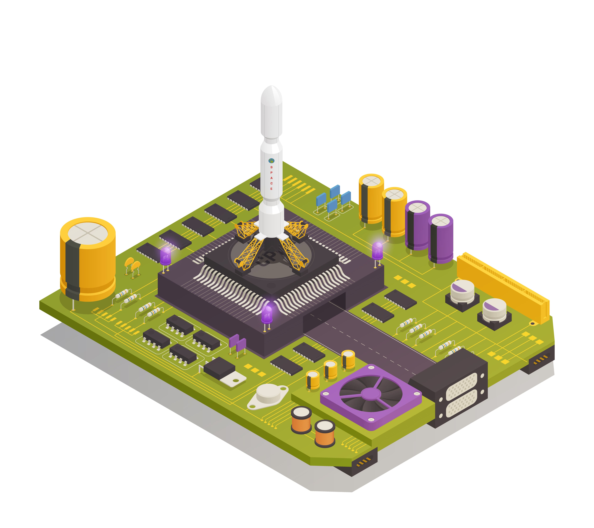

!!! quote
    **It's not important where you are right now, it's important what direction you're headed.**

# 前言
这是一份针对非CS类专业同学的学习指南，编者主要来自清华、人大高瓴人工智能学院、CMU。

本指南目前包括了以下部分(如果你有其他好的建议，或者想加入贡献的行列，欢迎在本网站的 issue 里提问)：

* **本书使用指南：** 由于互联网上的各种CS类课程浩如烟海，针对非CS专业同学的学习特点，我们根据不同人群的空闲时间和学习目标制定了对应的使用指南，力求高效准确学习所需的知识，而不是将时间和精力放在一些艰难的、过于基础的内容上。
* 针对非计算机相关专业的CS学习规划：如何在空余的时间（课后，周末或是假期）高效集中学习CS？本规划详细列出了从简单的Python编程开始直到诸如大语言模型(LLM)等热门领域的学习规划。
* 互联网上，到处都有许多的学习资源，然而精华与糟粕并存。你所需要的，不是一个诸如“200+免费在线课程”的清单，而是以下问题的答案：
* 你应当学习哪些科目，为什么？
* 对于这些科目，最好的书籍或者视频课程是什么？

在这份指引中，我们尝试对这些问题做出确定的回答。

## 为什么学习计算机科学？
自从香农提出信息论以来，信息技术不断发展，逐渐吞噬世界。所有的科学研究、商业分析都可以抽象为对信息的处理。而计算机作为信息处理的工具，成为了信息技术最佳的代名词。

计算机诞生之初，就是为了给人类提供计算服务，随着人类数学的不断发展，人类想要计算的东西越来越多。如傅里叶最早给法国军队服役，为了计算出炮弹的轨迹还发明了炮击计算尺。二战期间，盟军为了破译德国的电报密码，专门让图灵制造出了最早的密码破解计算机。

计算机科学正在成为各个学科的基石，如今的计算机科学更像是一门工具学科，随着计算机的发展，聪明的计算机科学家们抽象出很多更加底层的概念来，各种各样的算法与数据结构，应用大量数学工具来处理计算机面对的各种问题。而在金融等热门领域，计算机科学作为一门工具学科，极大丰富和提升了行业的发展速度，现在越来越多的从业者使用Python, MATLAB等工具进行数据分析、量化交易，大型投行的交易流程（交易触发机制、交易策略）也大部分由计算机软件实现。

国内金融、数学等学科的培养方案往往并没有系统、完整的CS培养方案，研究生接触CS课题和项目的机会也少之甚少，因此如何快速、高效地构建自己CS方向的技能树显得尤为重要。

## 这本指南适合谁
正如我在前言里说的，任何有志于在空闲时间内自学计算机的朋友都可以参考这本书。如果你已经有了一定的计算机基础，只是对某个特定的领域感兴趣，可以选择性地挑选你感兴趣的内容进行学习。当然，如果你是一个像我当年一样对计算机一无所知的小白，初入大学的校门，我希望这本指南能成为你的攻略，让你花最少的时间掌握你的专业所需要的知识和能力。某种程度上，这本指南更像是一个根据我的体验来排序的课程搜索引擎，帮助大家在眼花缭乱的课程选择最适合自己的书本、课程。

希望这份资料能让那些同样有自学之心和毅力朋友可以少走些弯路，收获更丰富、更多样、更满足的学习体验。

## 实践出真知
!!! quote
    **Talk is cheap. Show me the code.**
不同于金融市场中，大多数人只能作为观察者进行分析和预测，在纯粹的计算机科学中，编程者就是三体中描述的秦始皇，统领3000万秦军构成的“人列计算机”，不断计算着下一次恒纪元的到来。

因此，我希望读者在之后的CS学习过程中勇于探索，勇于犯错。你会发现能够一步步自己创造一个切实可行的程序是一件很美妙的事情。

## 自律 + 专心
没有同学，没有DDL，没有期末考试的压力有时候是一件可怕的事情。
特别是随着学习的深入，国内外的很多课程是非常磨人、复杂的，很多复杂的程序可能需要修改上百次。
因此在学习的过程中，你得有足够的驱动力强迫自己静下心来，阅读几十页的 Guideline，理解复杂的代码框架，忍受数个小时的 debug 时光。而这一切，没有学分，没有绩点，没有老师，没有同学，有的只是无限进步的信念。

## 特别鸣谢
在这里，我怀着崇敬之心真诚地感谢所有将课程资源无偿开源的各位教授、科研工作者以互联网从业者。这些课程和书本倾注了他们数十年教学工作实践的积淀和心血。希望大家也能够发扬“开源”精神，促进学科交流。