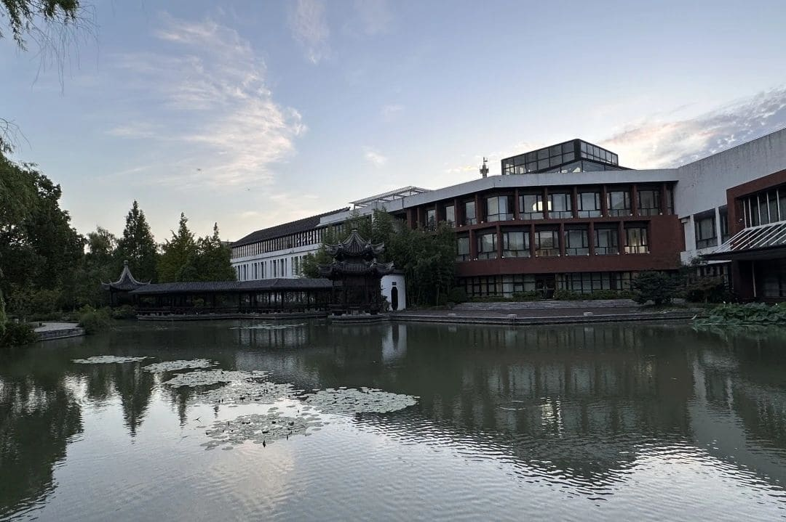

<figure markdown>

</figure>
## 重生中法，梦开始的地方
白驹过隙，小时候觉得时间过得很慢，但不知道从什么时候开始，时光的流逝就让人开始变得恍惚。初入中法之际的迷茫，困惑与不知所措，萦绕在心头，总想着如果当时信息摄取的更全面一些，知道的路径更多一些，在之后的路途也会更顺畅一些。

当然，我对于过去走过的每一步路都不后悔，其实我也惊觉我自小起，所走的每一步都与环境格格不入，都在高压锅般的环境中挣扎。从中法毕业期年之久，想着也该留下一些文字的经验与总结，为后来可能需要帮助的人一点信息。

另外，如果我的经历与文字可以为那些不被主流社会所期待的孤勇者一些正向激励，那便潸然泪下了。

## 为什么要做这个网站
本网站旨在为中法学子提供一个比较完整可行的商科升学、求职路径图，旨在为初入中法，对商科毫无了解的低年级新生与仍然存在迷茫，面临道路抉择的高年级中法本科生提供较为客观全面的信息，而避免过多的价值判断，干扰读者的自我思考。

本网站尽可能呈现更多的可能性，但是路径是客观存在的，但是同一条路径一定不会适合所有人，读者可以结合自己的未来规划与特长，参考本网站提供的信息，做出最适合自己的路径选择。

此外，制作一份“非官方”的指南，也可以做出更多“官方”身份不宜做出的解读。

由于本网站仍处于起步阶段，很多信息和资源仍在收集过程中，请各位谅解，感兴趣的读者可以收藏关注本网站，近期将上线重要的职业规划和学科资源。

## 自学与自律
本网站除了提供升学、求职路径之外，也会给出路径上需要补充背景的技能、学科等自学方法。对于高中生来说，往往是缺乏自学能力的，但是有效的自学在大学以及未来的生活中是及其重要的，我们鼓励中法学子积极尝试自学，培养自学能力，化他律为自律，培养独立思考的能力，而不仅仅是被推着走，不知道目的是哪里。

当然，考虑到东亚家长普遍的心路历程与育儿经历，我们深刻理解那种不合适的控制欲，大多数人的成长经历还是与自律所相矛盾的，我们也希望通过此网站可以给予读者精神的支持，以及如果读者有幸有下一代，可以推进亲子关系的自由、平等、尊重。

## 这个网站适合谁
本网站适合全体中法学子，尤其是商科学子，或者想要转商科的学子。金融已死的论调不绝于耳，如果你坚定的认可，不久的未来，传统金融行业将会迎来又一春，那么你可以在这个网站中查询传统金融路线的发展途径；

如果你认为经济有周期，人无再少年，那么本网站也会为你提供转码路径路径，包括但不限于量化、AI；更重要的是，如果可以激发你的灵感，让你走出一条全新的路径，可供后人参考复制，那么我希望你可以联系我们，丰富完善我们的路径地图。

我们常说，种一棵树最好的时间是十年前，其次是现在。虽然新生是白纸，有很强的可塑性，但是即便当你看到本网站时，已经大三了，那也可以微调，也还有优化的空间。

## 特别鸣谢
本人水平有限，也未在学界、业界有所建树，但所幸周围朋友高手如云，愿意帮助搭建本网站，完善个中内容，开拓更多路径可能，尤其感谢清、北、人等计算机、人工智能相关的团队成员，大家都知道纯金融背景的学生是没有技术的，离不开专业技术人员的大力支持。

## 如果你也想成为贡献者
如果你在阅读本网站后，认同我们的理念，并且认为有较好的想法与创意，可以与我们联系。

## 商业模式
本网站完全开源与免费，由上海乐湖修远教育科技有限公司赞助与支持。上海乐湖修远教育科技有限公司，扎根中法，为中法学生提供升学、法语培训、学科指导等服务，详情请关注公众号“i乐湖”。

-   :fontawesome-brands-weixin:{ .lg .middle } __官方公众号__

    ---

    [:octicons-arrow-right-24: <a href="https://mp.weixin.qq.com/s/cN9UfU4qf2_02-FOgVKXTw" target="_blank"> "i乐湖"传送门 </a>](#)

    <figure markdown>
    { width="150" }
    </figure>

